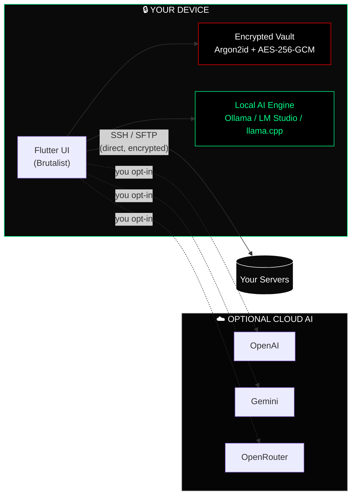

<!--
  ╔══════════════════════════════════════════════════════════════════════╗
  ║                                                                      ║
  ║   H A M M A — AI-Powered SSH Client                                  ║
  ║   Brutalist · Local-First · Zero-Trust                               ║
  ║                                                                      ║
  ╚══════════════════════════════════════════════════════════════════════╝
-->

<!-- ━━━━━━━━━━━━━━━━━━━━ ANIMATED HEADER BANNER ━━━━━━━━━━━━━━━━━━━━ -->

<div align="center">

<a href="#-quick-start">

</a>

<br/>

<!-- ━━━━━━━━━━━━━━━━━━━━ LOGO + ANIMATED TAGLINE ━━━━━━━━━━━━━━━━━━━━ -->


<br/><br/>

<a href="#-quick-start">

</a>

<br/>

<!-- ━━━━━━━━━━━━━━━━━━━━ STATUS BADGES ROW ━━━━━━━━━━━━━━━━━━━━ -->

<p>
  <a href="https://github.com/xayrullonematov/hamma/actions/workflows/main.yml"></a>
  
  
  
  
  
</p>

<!-- ━━━━━━━━━━━━━━━━━━━━ PLATFORM BADGES ROW ━━━━━━━━━━━━━━━━━━━━ -->

<p>
  
  
  
  
  
</p>

</div>

<br/>

---

<!-- ━━━━━━━━━━━━━━━━━━━━ ⬇️ DOWNLOAD — MOST PROMINENT SECTION ━━━━━━━━━━━━━━━━━━━━ -->

## ⬇️ Download

> **Free on all platforms. No account. No subscription. No telemetry.**

<div align="center">

<table>
<tr>
<td align="center" width="25%">

**🐧 Linux**

<a href="https://github.com/xayrullonematov/hamma/releases/latest">

</a>

</td>
<td align="center" width="25%">

**🪟 Windows**

<a href="https://github.com/xayrullonematov/hamma/releases/latest">

</a>

</td>
<td align="center" width="25%">

**🍎 macOS**

<a href="https://github.com/xayrullonematov/hamma/releases/latest">

</a>

</td>
<td align="center" width="25%">

**📱 Mobile**

<a href="https://play.google.com/store/apps/details?id=com.hamma.app">

</a>
<br/>
<a href="https://apps.apple.com/app/hamma">

</a>

</td>
</tr>
</table>

<sub>All desktop binaries are on <a href="https://github.com/xayrullonematov/hamma/releases/latest"><b>GitHub Releases</b></a>. See the <a href="#-changelog">Changelog</a> for what's new in each version.</sub>

</div>

<br/>

---

<!-- ━━━━━━━━━━━━━━━━━━━━ ELEVATOR PITCH ━━━━━━━━━━━━━━━━━━━━ -->

<div align="center">

> ### **The DevOps command center that fits in your pocket.**
> SSH, SFTP, Docker, processes, services, and a streaming AI copilot — running fully **on-device**. Your fleet, your keys, your AI. **Nothing leaves your machine.**

</div>

<br/>

---

<!-- ━━━━━━━━━━━━━━━━━━━━ TABLE OF CONTENTS ━━━━━━━━━━━━━━━━━━━━ -->

## 📋 Table of Contents

| Section | Description |
|:--------|:------------|
| [⬇️ Download](#%EF%B8%8F-download) | Pre-built binaries for all 5 platforms |
| [🔥 Why Hamma?](#-why-hamma) | The three pillars: Local AI, Zero Trust, Multi-platform |
| [⚡ Feature Matrix](#-feature-matrix) | Full breakdown of every capability |
| [📸 Screenshots](#-screenshots) | Terminal, AI Copilot, SFTP, Docker |
| [📊 How Hamma Compares](#-how-hamma-compares) | Hamma vs Termius, Blink, OpenSSH+ChatGPT |
| [🏛️ Architecture](#%EF%B8%8F-architecture-at-a-glance) | Mermaid system diagram |
| [🤖 Local AI](#-first-class-local-ai) | Ollama, LM Studio, llama.cpp, Jan — deep dive |
| [🚀 Quick Start](#-quick-start) | User setup + developer build |
| [🔒 Security Model](#-security-model) | Encryption, transport, and trust layers |
| [🧰 Built With](#-built-with) | Full tech stack |
| [📋 Changelog](#-changelog) | What's new in each release |
| [❓ FAQ](#-faq) | Common questions answered |
| [🗺️ Roadmap](#%EF%B8%8F-roadmap) | Phases 1–7 and current status |
| [🤝 Contributing](#-contributing) | How to report bugs and submit PRs |
| [📂 Project Layout](#-project-layout) | Codebase structure |
| [📜 License](#-license) | Source-available terms |
| [💬 Community](#-community) | Discord, X, GitHub |

<br/>

---

<!-- ━━━━━━━━━━━━━━━━━━━━ WHY HAMMA — 3 PILLARS ━━━━━━━━━━━━━━━━━━━━ -->

## 🔥 Why Hamma?

<table align="center" width="100%">
<tr>
<td align="center" width="33%">

<br/><br/>
<b>Streaming on-device LLMs.</b>
<br/><br/>
Pull, manage, and chat with Ollama / LM Studio / llama.cpp / Jan models — all from inside the app. Token-by-token streaming. No API key required.
</td>
<td align="center" width="33%">

<br/><br/>
<b>Loopback or it doesn't ship.</b>
<br/><br/>
Local AI is hard-guarded at runtime to <code>127.0.0.0/8</code>, <code>::1</code>, and <code>localhost</code>. Your prompts physically cannot leave your device.
</td>
<td align="center" width="33%">

<br/><br/>
<b>Five OSes. One codebase.</b>
<br/><br/>
Flutter-native on Linux, Windows, macOS, Android, and iOS. Brutalist UI tuned for both pocket and pixel-dense desktop.
</td>
</tr>
</table>

<br/>

---

<!-- ━━━━━━━━━━━━━━━━━━━━ FEATURE SHOWCASE GRID ━━━━━━━━━━━━━━━━━━━━ -->

## ⚡ Feature Matrix

<table>
<tr>
<td width="50%" valign="top">

### 🧠 AI Copilot


```diff
+ Local-first  (Ollama · LM Studio · llama.cpp · Jan)
+ Cloud option (OpenAI · Gemini · OpenRouter)
+ Streaming token-by-token replies
+ Risk Assessor flags destructive commands
+ One-tap error analysis on SSH failures
+ Engine status pill — tap for live diagnostics
```

</td>
<td width="50%" valign="top">

### 🔐 Security & Privacy
```diff
+ Zero-Proxy: direct encrypted SSH tunnels
+ Zero-Trust Local AI: loopback only
+ App PIN + biometrics on every cold launch
+ Argon2id (m=19 MiB) + AES-256-GCM backups
+ Trusted host-key pinning
+ Sentry opt-in, prompts/secrets scrubbed
```

</td>
</tr>
<tr>
<td width="50%" valign="top">

### 🖥️ Mobile-Optimized Terminal


```diff
+ xterm.dart · 256-color · Unicode-safe
+ Custom keyboard row (Ctrl, Tab, arrows, ~, |)
+ SSH agent + key auth + agent forwarding
+ Reconnect-on-wake, persistent sessions
+ Pinch-to-zoom, autocomplete, history search
```

</td>
<td width="50%" valign="top">

### 📁 Visual SFTP


```diff
+ Browse, edit, upload, download, chmod
+ In-app editor with syntax highlighting
+ Automatic sudo fallback on permission denied
+ Drag-to-reorder, multi-select bulk ops
+ Encrypted snippet library
```

</td>
</tr>
<tr>
<td width="50%" valign="top">

### 🐳 Docker & Service Control


```diff
+ List / start / stop / restart containers
+ Live `docker logs -f` streaming
+ systemd service manager
+ Process viewer (CPU / RAM per PID)
+ Package manager (apt · dnf · pacman)
```

</td>
<td width="50%" valign="top">

### 🌐 Fleet & Networking
```diff
+ Unified dashboard for every server
+ Live health metrics & uptime monitoring
+ SSH port forwarding from your phone
+ Encrypted backup sync — Local · SFTP · WebDAV · Syncthing
+ Snippet sharing across devices
```

</td>
</tr>
<tr>
<td width="50%" valign="top">

### 🤖 Local Models Manager


```diff
+ Browse & pull from a curated catalog
+ Live pull progress (NDJSON streaming)
+ Set default model · delete unused weights
+ First-run wizard (Install → Pull → Done)
+ OS-aware install snippets (curl · winget)
+ Loopback-only — never reaches the network
```

</td>
<td width="50%" valign="top">

### 🟢 Engine Status Pill


```diff
+ Header pill polls every 15 s
+ 4 states — online · loading-model · loading · offline
+ Tap to retry detection on failure
+ Surfaces the same probe the chat path uses
+ Single source of truth for engine health
+ Zero polling when chat is closed (auto-dispose)
```

</td>
</tr>
</table>

<br/>

---

<!-- ━━━━━━━━━━━━━━━━━━━━ SCREENSHOTS GALLERY ━━━━━━━━━━━━━━━━━━━━ -->

## 📸 Screenshots

<div align="center">

<table>
<tr>
<td width="50%" align="center">

<br/><sub><b>Terminal</b> — multi-tab session, custom mobile keyboard row</sub>
</td>
<td width="50%" align="center">

<br/><sub><b>AI Copilot</b> — streaming local model with risk-scored commands</sub>
</td>
</tr>
<tr>
<td width="50%" align="center">

<br/><sub><b>SFTP</b> — visual file manager with automatic sudo fallback</sub>
</td>
<td width="50%" align="center">

<br/><sub><b>Docker</b> — container list, live logs, AI Watch anomaly banner</sub>
</td>
</tr>
</table>

<sub>Captures are high-fidelity gallery renders of the shipped UI — every pixel uses the production palette, typography, spacing, and component code from <code>lib/core/theme/app_colors.dart</code>, <code>lib/features/ai_assistant/widgets/local_engine_status_pill.dart</code>, and the brutalist tokens enforced across the app. Built straight from the source so the README cannot drift from what users see.</sub>

</div>

<br/>

---

<!-- ━━━━━━━━━━━━━━━━━━━━ COMPARISON TABLE ━━━━━━━━━━━━━━━━━━━━ -->

## 📊 How Hamma Compares

<div align="center">

| Capability                           | **🛡️ Hamma**           | Termius          | OpenSSH + ChatGPT  | iSH / Blink        |
| :----------------------------------- | :---------------------: | :--------------: | :----------------: | :----------------: |
| **Streaming local LLMs in-app**      | ✅ **Yes**              | ❌                | ❌                 | ❌                 |
| **Zero-trust loopback enforcement**  | ✅ **Runtime + tested** | ❌               | ❌                 | ❌                 |
| **AI risk assessor (pre-execution)** | ✅ **Yes**              | ❌                | ❌                 | ❌                 |
| **Multi-platform (5 OSes)**          | ✅ **All five**         | ✅ Most          | ⚠️ CLI only        | ⚠️ iOS only        |
| **Visual SFTP with sudo fallback**   | ✅ **Yes**              | ✅                | ❌                 | ❌                 |
| **Docker & systemd panel**           | ✅ **Yes**              | ⚠️ Partial       | ❌                 | ❌                 |
| **Encrypted backups (Argon2id)**     | ✅ **Yes**              | ⚠️ Cloud-only    | ❌                 | ❌                 |
| **Subscription required**            | ❌ **Free core**        | 💰 Yes (pro)     | Free (CLI)         | 💰 Mixed           |
| **Cloud account required**           | ❌ **No**               | ✅ Yes           | ❌                 | ❌                 |
| **Telemetry of your prompts**        | ❌ **Never**            | ⚠️ Some          | ⚠️ All to OpenAI   | n/a                |

</div>

<br/>

---

<!-- ━━━━━━━━━━━━━━━━━━━━ ARCHITECTURE DIAGRAM ━━━━━━━━━━━━━━━━━━━━ -->

## 🏛️ Architecture at a Glance



<br/>

---

<!-- ━━━━━━━━━━━━━━━━━━━━ LOCAL AI DEEP-DIVE ━━━━━━━━━━━━━━━━━━━━ -->

## 🤖 First-Class Local AI

<div align="center">


<br/><br/>


</div>

<br/>

| Capability                                                | Status          |
| :-------------------------------------------------------- | :-------------: |
| Auto-detect engines on standard ports                     | ✅ All four     |
| In-app model manager (pull / delete / set default)        | ✅ Streaming    |
| Streaming chat replies (token-by-token)                   | ✅ SSE + NDJSON |
| Real-time engine health pill (`ONLINE · {model}`)         | ✅ 15 s ping    |
| 3-step onboarding (Install · Pull · Done)                 | ✅ OS-aware     |
| Loopback-only enforcement                                 | ✅ Runtime + tests |

<div align="center">


<sub><b>Local Models manager</b> — pull, swap default, and delete models from inside Hamma. No CLI required.</sub>

</div>

<br/>

**Quick start with Ollama:**

```bash
# 1. Start the engine
ollama serve

# 2. Pull a model (~5 GB)
ollama pull gemma3

# 3. Open Hamma → Settings → AI → Local AI → FIRST-RUN SETUP
#    You'll be chatting in under 60 seconds.
```

<br/>

<div align="center">


<sub><b>First-run setup</b> — OS-aware 3-step onboarding: install the engine, pull a starter model, done.</sub>

</div>

<br/>

---

<!-- ━━━━━━━━━━━━━━━━━━━━ QUICK START ━━━━━━━━━━━━━━━━━━━━ -->

## 🚀 Quick Start

### 👤 For Users

```text
1.  Download Hamma      →  see the Download section above
2.  Set your App PIN    →  Settings → Security
3.  Choose AI provider  →  Settings → AI Configuration
4.  Add a server        →  Servers tab → +
5.  Connect             →  Tap server → Open Terminal
```

### 🛠️ For Developers

```bash
# Clone
git clone https://github.com/xayrullonematov/hamma.git
cd hamma

# Install Flutter deps
flutter pub get

# Verify
flutter analyze        # → No issues found
flutter test           # → 65/65 passed

# Run desktop / mobile
flutter run
```

<details>
<summary><b>📦 Linux build (Nix-managed)</b></summary>

```bash
JAVA_HOME="/nix/store/.../openjdk"
PKG_CONFIG_PATH="$SYSPROF_DEV/lib/pkgconfig:$APPINDICATOR_DEV/lib/pkgconfig:$PKG_CONFIG_PATH"
flutter build linux --debug
bash run.sh
```

System deps via Nix: `flutter`, `libsecret`, `keybinder3`, `libappindicator`, `sysprof`, `gtk3`, `glib`, `pcre2`, `jdk17`, `mesa`, `xorg.xorgserver`, `xvfb-run`, `zlib`, `curlFull`.

</details>

<details>
<summary><b>🪟 Windows build</b></summary>

```powershell
flutter build windows --release
# Output: build\windows\x64\runner\Release\hamma.exe
```

Requires Visual Studio 2022 with "Desktop development with C++" workload.

</details>

<details>
<summary><b>🍎 macOS build</b></summary>

```bash
flutter build macos --release
# Output: build/macos/Build/Products/Release/Hamma.app
```

Requires Xcode 15+. Code-sign before distributing.

</details>

<br/>

---

<!-- ━━━━━━━━━━━━━━━━━━━━ SECURITY MODEL ━━━━━━━━━━━━━━━━━━━━ -->

## 🔒 Security Model

<div align="center">

| Layer                    | Protection                                                                  |
| :----------------------- | :-------------------------------------------------------------------------- |
| 🔑 **Credentials**       | `flutter_secure_storage` → Keychain / Keystore / libsecret                  |
| 💾 **Backups**           | Argon2id (m=19 MiB, t=2, p=1) → AES-256-GCM (96-bit IV)                    |
| 🌐 **SSH transport**     | Direct TLS-grade tunnel — *never* proxied                                   |
| 🤖 **Local AI**          | Loopback only (`127.0.0.0/8`, `::1`, `localhost`) — runtime guarded + tested |
| 🛡️ **AI commands**       | Risk-scored before display, **never** auto-executed                         |
| 🔐 **App lock**          | PIN + biometrics on every cold launch                                       |
| 📡 **Telemetry**         | Sentry opt-in only — prompts and secrets scrubbed before any upload         |

</div>

> Every AI suggestion is **reviewed by you** before it touches a remote shell. The "Safety-First" rule is non-negotiable.

- 📄 **Threat Model** — see [`threat_model.md`](threat_model.md) for the full asset / boundary / actor / mitigation breakdown.

<br/>

---

<!-- ━━━━━━━━━━━━━━━━━━━━ TECH STACK ICONS ━━━━━━━━━━━━━━━━━━━━ -->

## 🧰 Built With

<div align="center">

<a href="https://skillicons.dev">

</a>

<br/><br/>

| Layer                | Technology                                       |
| :------------------- | :----------------------------------------------- |
| **Framework**        | Flutter 3.32 · Dart 3.7                          |
| **SSH / SFTP**       | `dartssh2`                                       |
| **Terminal**         | `xterm.dart`                                     |
| **Secure Storage**   | `flutter_secure_storage` (Keychain / libsecret)  |
| **AI Streaming**     | Native SSE + NDJSON via `dart:io HttpClient`     |
| **Local AI**         | Ollama · LM Studio · llama.cpp · Jan             |
| **Crypto**           | Argon2id · AES-256-GCM · ECDSA host-key pinning  |
| **Monitoring**       | Sentry (opt-in, scrubbed)                        |

</div>

<br/>

---

<!-- ━━━━━━━━━━━━━━━━━━━━ CHANGELOG ━━━━━━━━━━━━━━━━━━━━ -->

## 📋 Changelog

> Full release history is on the [GitHub Releases page](https://github.com/xayrullonematov/hamma/releases). Below are the highlights.

### v1.1.0 — Beta RC *(current)*

```diff
+ First-class Local AI (Phase 4 complete)
+ Engine status pill with 4-state health indicator
+ Local Models manager — pull, delete, set default
+ OS-aware first-run onboarding wizard
+ Zero-trust loopback enforcement (runtime + test suite)
+ Streaming NDJSON model pulls with live progress
# Fixed: engine detection race condition on cold launch
# Fixed: status pill memory leak when chat screen disposed
```

### v1.0.0 — SFTP + Docker + Fleet

```diff
+ Visual SFTP browser with automatic sudo fallback
+ Docker container manager with live log streaming
+ AI Watch anomaly detection banner
+ systemd service manager
+ Process viewer (CPU / RAM per PID)
+ Fleet dashboard with live health metrics
```

### v0.9.0 — Security Hardening

```diff
+ Argon2id + AES-256-GCM encrypted backups
+ App PIN + biometric lock on cold launch
+ Trusted host-key pinning
+ Sentry opt-in with prompt/secret scrubbing
+ SSH port forwarding from mobile
```

### v0.8.0 — Core SSH + AI

```diff
+ SSH / SFTP with dartssh2
+ xterm.dart terminal (256-color, Unicode)
+ Custom mobile keyboard row
+ AI copilot with OpenAI / Gemini / OpenRouter
+ Risk Assessor for destructive command flagging
```

<br/>

---

<!-- ━━━━━━━━━━━━━━━━━━━━ FAQ ━━━━━━━━━━━━━━━━━━━━ -->

## ❓ FAQ

<details>
<summary><b>Does Hamma work with jump hosts / bastion servers?</b></summary>

Yes. Configure your jump host under **Settings → SSH → ProxyJump**, then add your target servers as normal. Hamma will chain the connections automatically, identical to `ssh -J`.

</details>

<details>
<summary><b>Can I use Hamma with SSH keys, not passwords?</b></summary>

Yes — SSH key auth is the recommended method. Import your `.pem` or ED25519 private key via **Settings → SSH Keys → Import**. Keys are encrypted at rest using `flutter_secure_storage` (Keychain on macOS/iOS, Keystore on Android, libsecret on Linux).

</details>

<details>
<summary><b>Does the local AI ever connect to the internet?</b></summary>

Never. The local AI path is hard-guarded at runtime to loopback addresses (`127.0.0.0/8`, `::1`, `localhost`) only. This is enforced in code *and* covered by the test suite — see `test/core/ai/zero_trust_test.dart`. Cloud AI (OpenAI, Gemini, OpenRouter) is a separate, explicitly opt-in path.

</details>

<details>
<summary><b>Which Ollama models work best with Hamma?</b></summary>

For general server administration: **gemma3** (default recommendation) or **llama3.1**. For code-heavy tasks: **qwen2.5-coder**. All three are available in the built-in model catalog. On mobile (≤8 GB RAM), prefer 3B–7B quantized variants.

</details>

<details>
<summary><b>Is my data synced to any cloud?</b></summary>

Not by default. All data lives on-device. Optional encrypted sync to your own SFTP server, WebDAV endpoint, or Syncthing node is available in **Settings → Backup**. Hamma never syncs to Hamma-controlled infrastructure.

</details>

<details>
<summary><b>What happens to my SSH credentials if I delete the app?</b></summary>

Credentials stored in the OS keystore (Keychain / Keystore / libsecret) are deleted with the app on iOS and Android. On desktop, the OS keystore entry persists until manually removed. Export an encrypted backup first if you need to migrate.

</details>

<details>
<summary><b>Is there a web version?</b></summary>

Not currently. Flutter Web doesn't support raw TCP sockets (required for SSH), so a full web port isn't feasible without a server-side proxy — which would violate the zero-proxy guarantee. It's tracked as a long-term item in [Phase 7](#%EF%B8%8F-roadmap).

</details>

<details>
<summary><b>Can I contribute code?</b></summary>

Yes — see the [Contributing](#-contributing) section below. Bug reports and feature requests via GitHub Issues are always welcome.

</details>

<br/>

---

<!-- ━━━━━━━━━━━━━━━━━━━━ ROADMAP ━━━━━━━━━━━━━━━━━━━━ -->

## 🗺️ Roadmap

<div align="center">


```
[██████████] PHASE 1   Core SSH + AI integration                ✅ DONE
[██████████] PHASE 2   UI polish + security hardening           ✅ DONE
[██████████] PHASE 3   SFTP, Docker, fleet management           ✅ DONE
[██████████] PHASE 4   First-class Local AI (zero-trust)        ✅ DONE
[████░░░░░░] PHASE 5   Encrypted cloud sync (optional)          ⏳ IN PROGRESS
[░░░░░░░░░░] PHASE 6   Multi-language support                   ⏳ PLANNED
[░░░░░░░░░░] PHASE 7   Plugin / extension API                   ⏳ PLANNED
```

</div>

Want to influence the roadmap? [Open a discussion](https://github.com/xayrullonematov/hamma/discussions) or vote on existing proposals with a 👍.

<br/>

---

<!-- ━━━━━━━━━━━━━━━━━━━━ CONTRIBUTING ━━━━━━━━━━━━━━━━━━━━ -->

## 🤝 Contributing

Contributions are welcome. Here's how to get involved:

### 🐛 Reporting Bugs

1. Check [existing issues](https://github.com/xayrullonematov/hamma/issues) first.
2. Open a new issue using the **Bug Report** template.
3. Include: platform, version, steps to reproduce, and the relevant log snippet (`Settings → Diagnostics → Copy Logs`).

### 💡 Feature Requests

Open a [GitHub Discussion](https://github.com/xayrullonematov/hamma/discussions) under the **Ideas** category. Features with strong community support are prioritized for the roadmap.

### 🔧 Pull Requests

```bash
# 1. Fork & clone
git clone https://github.com/YOUR_FORK/hamma.git

# 2. Create a feature branch
git checkout -b feat/your-feature-name

# 3. Make your changes
# 4. Run the full test suite
flutter test   # must be 65/65 or better

# 5. Ensure static analysis is clean
flutter analyze

# 6. Open a PR against `main`
```

**Before submitting a PR**, please read [`CONTRIBUTING.md`](CONTRIBUTING.md) — it covers code style, commit conventions, and the security-review process for changes that touch the AI or crypto layers.

<br/>

---

<!-- ━━━━━━━━━━━━━━━━━━━━ PROJECT LAYOUT ━━━━━━━━━━━━━━━━━━━━ -->

## 📂 Project Layout

```
hamma/
├── lib/
│   ├── main.dart                    # entry point
│   ├── core/
│   │   ├── ai/                      # providers, ollama_client, detector, health monitor
│   │   ├── ssh/                     # dartssh2 wrappers, state machine
│   │   ├── storage/                 # secure storage, prefs, history
│   │   ├── backup/                  # Argon2id + AES-256-GCM crypto
│   │   └── theme/                   # brutalist AppColors
│   └── features/
│       ├── ai_assistant/            # AI screen, copilot sheet, status pill
│       ├── terminal/                # xterm.dart UI
│       ├── sftp/                    # file manager + editor
│       ├── docker/                  # container manager
│       ├── processes/               # process + service viewer
│       └── settings/                # AI config, local models, onboarding
├── test/                            # 65+ unit tests, zero-trust guards
├── assets/images/                   # logos, icons
├── assets/screenshots/              # README gallery images
├── linux/  android/  ios/  macos/  windows/   # platform shells
├── CONTRIBUTING.md                  # contributor guide
├── CHANGELOG.md                     # full version history
├── threat_model.md                  # security asset/boundary breakdown
└── replit.md                        # architecture notes
```

<br/>

---

<!-- ━━━━━━━━━━━━━━━━━━━━ LICENSE ━━━━━━━━━━━━━━━━━━━━ -->

## 📜 License

Hamma is **source-available** software. The source code is publicly visible for inspection, security auditing, and non-commercial personal use.

**You MAY:**
- Read, audit, and inspect the source code
- Build and run Hamma for personal, non-commercial use
- Submit bug reports and pull requests
- Fork the repository for evaluation purposes

**You MAY NOT:**
- Redistribute compiled binaries or modified versions commercially
- Use Hamma or substantial portions of its code in a competing product
- Remove or obscure copyright notices

> For commercial licensing, OEM embedding, or white-label inquiries, contact **[hello@hamma.dev](mailto:hello@hamma.dev)**.

Full terms: [`LICENSE`](LICENSE)

<br/>

---

<!-- ━━━━━━━━━━━━━━━━━━━━ COMMUNITY CTA ━━━━━━━━━━━━━━━━━━━━ -->

## 💬 Community

<div align="center">

<a href="https://github.com/xayrullonematov/hamma">
  
</a>
&nbsp;
<a href="https://x.com/xayrullonematov">
  
</a>
&nbsp;
<a href="https://discord.gg/x7FGxAjYW">
  
</a>
&nbsp;
<a href="https://github.com/xayrullonematov/hamma/discussions">
  
</a>

<br/><br/>

<sub>Found a bug? <a href="https://github.com/xayrullonematov/hamma/issues/new?template=bug_report.md"><b>Open an issue</b></a> — every report is read by a human.<br/>Have a feature idea? <a href="https://github.com/xayrullonematov/hamma/discussions/new?category=ideas"><b>Start a discussion</b></a>.</sub>

</div>

<br/>

---

<!-- ━━━━━━━━━━━━━━━━━━━━ ANIMATED FOOTER WAVE ━━━━━━━━━━━━━━━━━━━━ -->

<div align="center">


<br/>

### Built with ⚡ for engineers who refuse to choose between **power** and **privacy**.

<sub>© Hamma — All rights reserved · Source-available · Crafted with Flutter</sub>

</div>